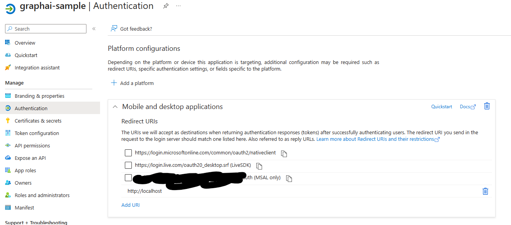

Semantic KernelにMicrosoft Graphと接続するSkillがあったので使い方を確かめてみる。

コードの実態は[Program.cs](./MsGraphSkillsSample/Program.cs)のみなのでコードはそちらを参考に。。

# 注意

* 2023/7/2時点の状態でコードを作成しているので参照タイミングによっては動かない可能性があります。

# 現在(2023/7/2)提供されているスキル

[Skills.MsGraph](https://github.com/microsoft/semantic-kernel/tree/main/dotnet/src/Skills/Skills.MsGraph)を参照

* Calendar
* CloudDrive
* Email
* TaskList

# 公式サンプルのある場所

[samples/dotnet/graph-api-skills/Program.cs](https://github.com/microsoft/semantic-kernel/blob/main/samples/dotnet/graph-api-skills/Program.cs)
※たぶんそのうちLearnに掲載されるであろうが。。。
※ただこのリポジトリのサンプルは各所変更している。

# 基本的な流れの認識

1. GraphServiceClientインスタンスの生成
1. 各スキルインスタンスの生成
1. SemanticKernelのビルド
1. SemanticKernelにSkill Import
1. SemanticKernelを介してSkillを使用

# Skillを試しに使ってみる

## このリポジトリのサンプルが提供する機能について

Microsfot ToDoで管理しているToDoリストの今日の日付のものを持ってきてChatGPTで作業工程を生成する。というもの。Skillの使い方とChatGPTとの組み合わせを試したかったのでそれらを組み合わせた必要最低限の構成にしている。

## GraphClientの作成

ちょっと面倒くさかったのでMSのサンプルと異なりオーソドックスな`PulicClientApplication`を使った。

``` csharp
// GraphClientまわりの設定
var graphConfig = configuration.GetRequiredSection("MsGraph").Get<MsGraphConfiguration>();
authClient = PublicClientApplicationBuilder.Create(graphConfig.ClientId).WithTenantId(graphConfig.TenantId).WithRedirectUri(graphConfig.RedirectUri.OriginalString).Build();

// めんどいから都度Login
var authRes = await authClient.AcquireTokenInteractive(graphConfig.Scopes).ExecuteAsync();
var account = authRes.Account;

// Skillに食わせるHttpClientとGraphClient作成
var handlers = GraphClientFactory.CreateDefaultHandlers(
    CreateAuthenticationProvider(authClient, graphConfig, account));
```

Azure ADアプリケーションは`Mobile and desktop applications`でlocalhostにリダイレクトされるように設定した。



`appsettings.json`の設定は、このコードの[appsettings.json](./MsGraphSkillsSample/appsettings.json)の`MsGraph`セクション参照。

## Semantic Kernelの設定

``` csharp
// Skill生成
var todoSkill = new TaskListSkill(new MicrosoftToDoConnector(graphServiceClient), loggerFactory.CreateLogger<TaskListSkill>());

// SemanticKernel生成
var skbuilder = Kernel.Builder.WithLogger(loggerFactory.CreateLogger<IKernel>());

// Azure OpenAIサービス
var deploymentName = configuration.GetValue<string>("AzureOpenAI:DeploymentName");
var endpoint = configuration.GetValue<string>("AzureOpenAI:Endpoint");
var key = configuration.GetValue<string>("AzureOpenAI:ApiKey");
skbuilder.WithAzureChatCompletionService(deploymentName, endpoint, key);

var sk = skbuilder.Build();
var todo = sk.ImportSkill(todoSkill, "todo");

var chatCompletion = sk.GetService<IChatCompletion>();
```

OpenAIサービスでチャットを行えるようにする設定とスキルのインポートを行っている。

`appsettings.json`の設定内容は[appsettings.json](./MsGraphSkillsSample/appsettings.json)の`AzureOpenAI`セクションを参考。

## チャット内部の処理

``` csharp
// ToDoを取得
var res = await sk.RunAsync(taskMemory, todo["GetDefaultTasks"]);
string task = res.Result;

// JSONで落ちてくるのでコントロールしやすい形に
var tasks = JsonSerializer.Deserialize<IEnumerable<ToDoData>>(task);

// Markdownチックな形式に整形ののち1この文字列にする（日付は日本時間を考慮し＋9時間する…超雑）
var taskList = tasks.Select(s => {
    return $"* {s.Title}(実行日: {s.Due.AddHours(9)})";
});
var taskString = String.Join("\n", taskList);

// Todoから予定を引っ張ってきてそれをベースにプロンプトを作成。
var prompt = "/n/nあなたは予定コンシェルジュです。\n" +
    "以下のタスクリストの{DATE}の実行日のものをすべて選択し、各予定で一般的に必要とされている作業工程を提示してください。\n" +
    "{TASKLIST}";

// Skillから取得したもろもろをpromptに反映
var s = prompt.Replace("{DATE}", daySt).Replace("{TASKLIST}", taskString);

// ChatGptになげる
chatHistory.AddUserMessage(s);
var settings = new ChatRequestSettings(){ MaxTokens = 2000 };
await foreach (string message in chatCompletion.GenerateMessageStreamAsync(chatHistory, settings))
{
    if (!string.IsNullOrEmpty(message))
    {
        Console.Write(message); 
    }
}
```
SemanticKernelインスタンスの`sk`の`RunAsync`からSkillを呼び出す。

`todo`から利用する機能を文字列で指定するのはちょっと面倒。`TaskListSkill`が提供するメソッドっぽい。

JSONで返却されるのだが、要約をかますとかChatGPTに投げたい場合は加工したほうが良いと思うので`JsonSerializer`あたり使って加工するのが良さげ。

以降はオーソドックスなChatCompletion処理。

# 結果

## Todoの内容


## 実行後の内容


