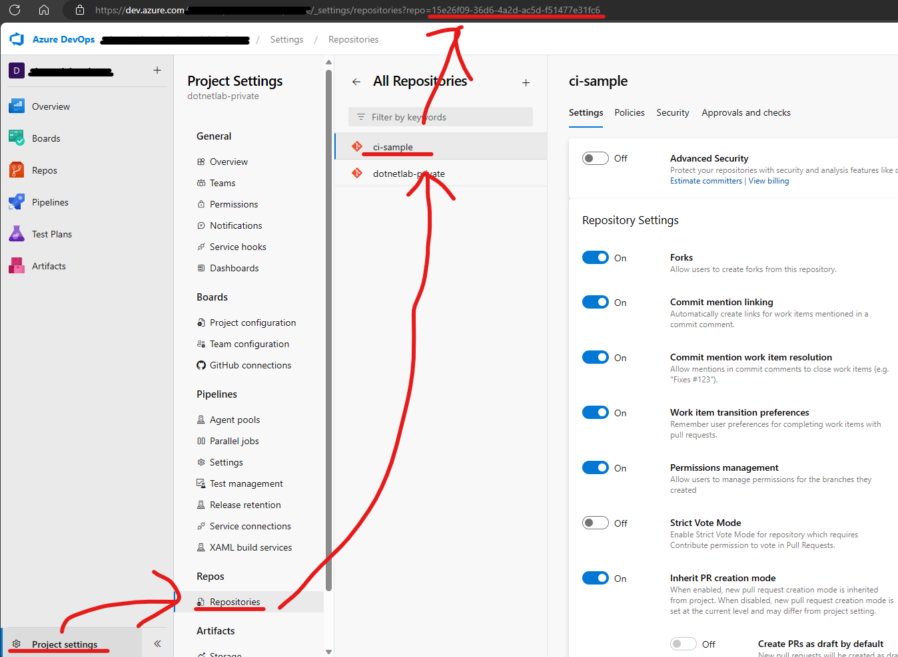
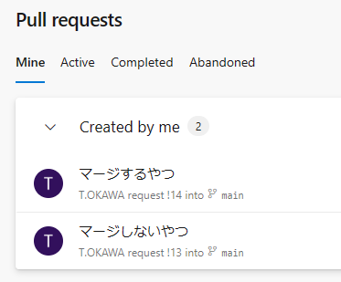
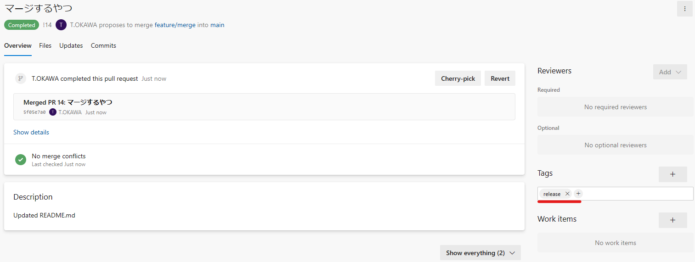
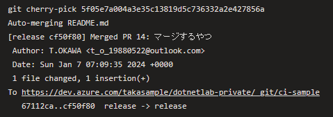
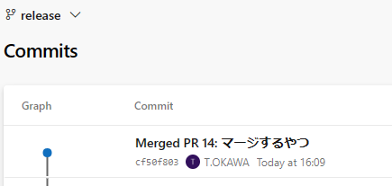
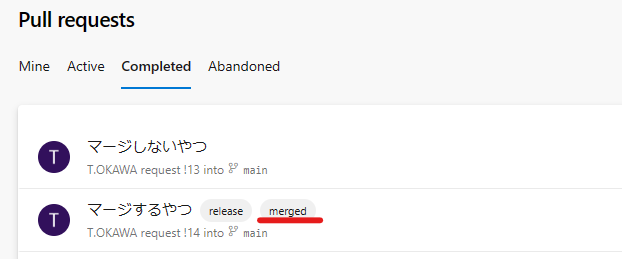

# やりたいこと

AzureDevOpsのPRにラベルが付けられてたら手動（あるいはスケジューラ実行）で特定ブランチにCherryPickしたい。

[Scaled Trunk-Based Development](https://trunkbaseddevelopment.com/)の開発でReleaseブランチに持っていく動きを省力化したい。という感じ。

# ymlファイルの構成について

[YMLファイル](./.ado/sample.yml)を参照。このYMLは下記のような順番で処理を実行する。

1. CherryPickを実行するブランチにスイッチする
2. 特定リポジトリのPRの一覧を取得する
3. PRごとにCherryPick対象かチェックを行う
  - CherryPick対象はラベル`release`がついていて且つCherryPickされている`merged`ラベルがついているもの以外
4. CheryPick対象のPRのマージコミットをCheryPickする
5. CherryPick済みのPRに`merged`ラベルを付与する

幾つか特殊な部分をピックアップする。

## fetchDepth: 0

デフォの状態ではGitの履歴情報を取得していないようなので`fetchDepth:0`を指定して履歴をすべて取得するようにしている。

## Invoke-RestMethod

下記の2つのリクエストを実行している。

* GET `repositories/{repositoryId}/pullrequests`
* POST `repositories/{repositoryId}/pullrequests/${prId}/labels`

それぞれ特定のリポジトリのPRの一覧の取得とPRへのラベルの付与を行っている。

リポジトリIDはパッと見みつからないがProjectSettingsから把握することができる。

あとはAPIだと"label"なんだけどUI上は"Tags"となっているので注意する必要がある。

リソースには`System.AccessToken`で取得できるアクセストークンを利用してアクセスできる。

API VersionのPreviewの最新は7.2のようだが7.2自体展開していないところも多いようなので、7.1のpreviewの`api-version=7.1-preview.1`使用するのが良さそう。

# WebAPIのレスポンスをみるためには

フロー上でアクセストークンを渡しているので、アクセストークンがないと見れない？と勘違いするかもしれないが

GETのリクエストであればブラウザ上から上記で生成されたURLを叩けば返却されるJSONを参照することができる。

JSONを落としておいてPowershellやBashのコマンドを組み立てるのはローカルで…ということも可能。

# 検証

1.PRを2つ作成しmainにマージしておく

PR13がリリースブランチにマージしないもの、PR14がリリースブランチにマージするもの。

2.リリースブランチにマージするPR14にラベルを付与する

3.CIを実行

4.リリースブランチに14のみマージされている

5.CherryPickしたPRにラベルが付与されている

# あとの課題

- データ量が多い場合コミットログのNextやSkipを駆使しないといけなそう…
- Cherry-Pick時にエラー吐いたとき（コンフとか）にキャッチできない

## 参考文献

- [steps.checkout 定義](https://learn.microsoft.com/ja-jp/azure/devops/pipelines/yaml-schema/steps-checkout?view=azure-pipelines#shallow-fetch)
- [定義済み変数の使用](https://learn.microsoft.com/ja-jp/azure/devops/pipelines/build/variables?view=azure-devops&tabs=yaml)
- [Pull Request Labels - List](https://learn.microsoft.com/ja-jp/rest/api/azure/devops/git/pull-request-labels/list?view=azure-devops-rest-7.1)
- [Pull Requests - Get Pull Requests](https://learn.microsoft.com/ja-jp/rest/api/azure/devops/git/pull-requests/get-pull-requests?view=azure-devops-rest-7.1&tabs=HTTP#pullrequeststatus)