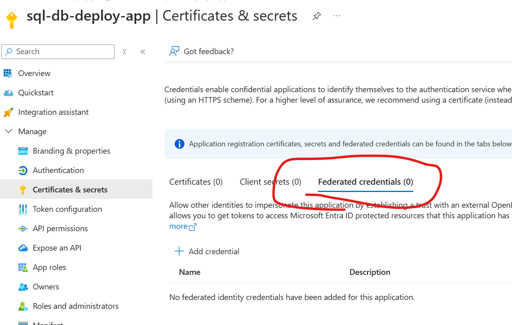
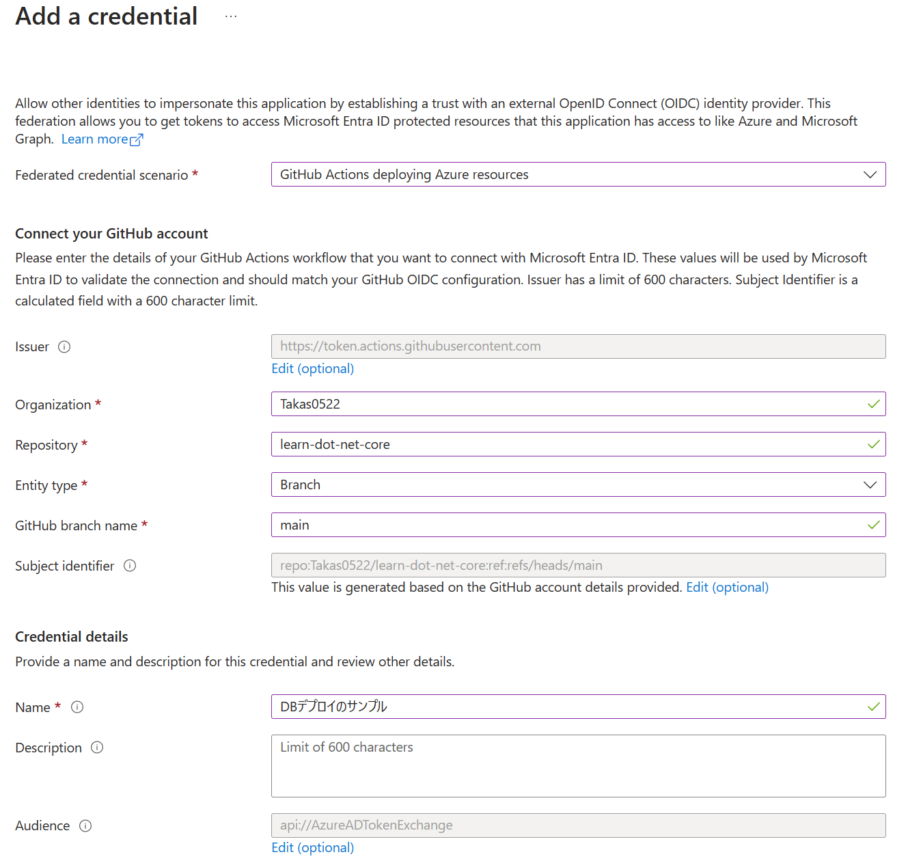

# MSBuild.Sdk.SqlProjで構成したSQL projをEntraフェデレーションを使ってAzureにデプロイしてみる

通常のSQL ProjだとMS Buildの構成が必要だったりとCIで面倒くさい。

あわせて、CIでシークレットの管理をしたくもないのでフェデレーションでDBの認証ができないか検証した。

まぁCIのDBデプロイの面倒くささは上記のみに起因したお話ではないが、とっかかりの面倒くさい部分を解消してみたい。

## sql projを作成する

`dotnet new sqlproj -s [バージョン]`でプロジェクトを作成

バージョンの対応は[SQLServerVersionのEnum](https://learn.microsoft.com/ja-jp/dotnet/api/microsoft.sqlserver.dac.model.sqlserverversion?view=sql-dacfx-162)と同一となっている。

ビルドマシンの構成やSDK.sqlProjのバージョンによっては`global.json`でSDKの指定をする必要がありそう。

テーブルやProcedureの作成は[MSBuild.Sdk.SqlProjのリポジトリ](https://github.com/rr-wfm/MSBuild.Sdk.SqlProj)に掲載されている。

`dotnet`コマンドでビルドなど可能。`dotnet build`で`*.dacpac`ファイルが作成される。

## Entraアプリを作成してフェデレーションできる構成を作成する





このプロジェクトのリポジトリを指定。

## Databaseの設定

先ほど作成したEntraアプリをAzure SQL DBで利用できるようにする。

```sql
Create User [作成したユーザー(上の例だとsql-db-deploy-app)] From EXTERNAL PROVIDER;
Alter Role [db_ddladmin] Add Member [作成したユーザー(上の例だとsql-db-deploy-app)]; --dboadminは重いと思うのでこれ。場合によってはdboのがいいかも。
```

## CIの作成

``` yml
name: DatabaseDeploy

on:
  workflow_dispatch:

permissions:
  id-token: write
  contents: read

jobs:
  pre-build-job:
    runs-on: windows-latest
    steps:
    - uses: actions/checkout@v1

    - name: 'Azure Login'
      uses: azure/login@v1
      with:
        client-id: ${{ secrets.AZURE_CLIENT_ID }}
        tenant-id: ${{ secrets.AZURE_TENANT_ID }}
        subscription-id: ${{ secrets.AZURE_SUBSCRIPTION_ID }}

    - name: 'dotnet build'
      shell: pwsh
      run: |
        cd sqldb-deploy-using-fed/SqldbDeployUsingEntraFed
        dotnet restore
        dotnet build --configuration Release

    - name: 'azure deploy'
      uses: azure/sql-action@v2.2
      with:
        connection-string: ${{ secrets.CONNECTION_STRING }}
        path: 'sqldb-deploy-using-fed/SqldbDeployUsingEntraFed/obj/Release/netstandard2.0/SqldbDeployUsingEntraFed.dacpac'
        action: 'Publish'

    - name: Logout
      run: az logout
```

## GitHub上での設定

各シークレットの設定を行う

- AZURE_CLIENT_ID: EntraAppのClientId
- AZURE_TENANT_ID: EntraAppのTenantId
- AZURE_SUBSCRIPTION_ID: EntraAppのSubscriptionId
- CONNECTION_STRING: DBの接続文字列

接続文字列はManaged Identityで接続するときと同様の形式でOK

`Server=<servername>;Initial Catalog=<database>;Authentication=Active Directory Service Principal; Encrypt=True;TrustServerCertificate=False;`

# 参考

- [Azure での OpenID Connect の構成](https://docs.github.com/ja/actions/deployment/security-hardening-your-deployments/configuring-openid-connect-in-azure)
- [GitHub Actions を使用して Azure に接続する](https://learn.microsoft.com/ja-jp/azure/developer/github/connect-from-azure?tabs=azure-portal%2Cwindows)
- [Azure SQL Deploy](https://github.com/marketplace/actions/azure-sql-deploy)